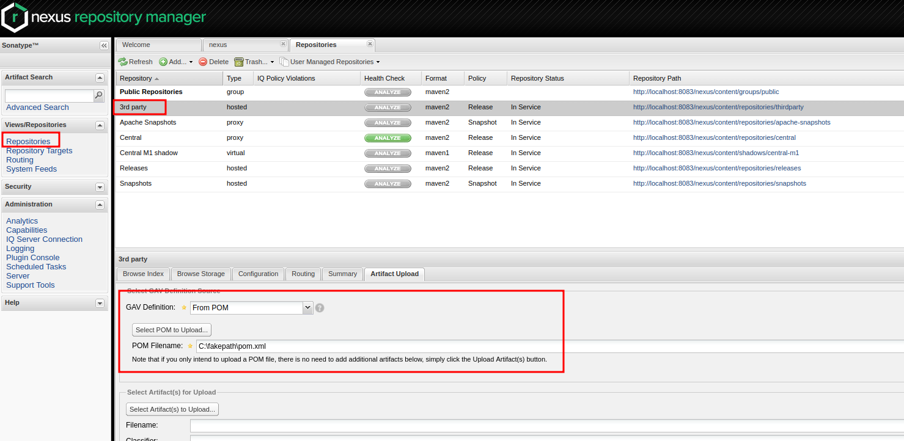

# Issue with quarkus and maven and teamcity which starts build via org.codehaus.plexus.classworlds.launcher.Launcher
This was tested on:
- Ubuntu 22.04
- Java 17
- Maven 3.9.3


## 1. Run nexus container
To do this you might just use nexus oss container:

`docker run -d -p 8083:8081 --name nexus sonatype/nexus:oss`

url is `http://localhost:8083/nexus/#welcome`

Then log in (admin/admin123) and disable anonymous access:
Administration -> Server -> Disable Anonymous Access

## 2. build dependency and upload to nexus

upload pom of dummy to nexus repository 3rd party



## 3. local environment
make sure to have a valid local maven (3.9.3) and java installation

add your maven home in [teamcity.m2.conf](code-with-quarkus%2Fteamcity.m2.conf)

## 4. run

running [maven-settings.sh](code-with-quarkus%2Fmaven-settings.sh) should work

running [teamcity.sh](code-with-quarkus%2Fteamcity.sh) should fail with

Full exception with -X Parameter:

```
org.apache.maven.lifecycle.LifecycleExecutionException: Failed to execute goal io.quarkus.platform:quarkus-maven-plugin:3.2.2.Final:generate-code-tests (default) on project code-with-quarkus: Quarkus code generation phase has failed
    at org.apache.maven.lifecycle.internal.MojoExecutor.doExecute2 (MojoExecutor.java:333)
    at org.apache.maven.lifecycle.internal.MojoExecutor.doExecute (MojoExecutor.java:316)
    at org.apache.maven.lifecycle.internal.MojoExecutor.execute (MojoExecutor.java:212)
    at org.apache.maven.lifecycle.internal.MojoExecutor.execute (MojoExecutor.java:174)
    at org.apache.maven.lifecycle.internal.MojoExecutor.access$000 (MojoExecutor.java:75)
    at org.apache.maven.lifecycle.internal.MojoExecutor$1.run (MojoExecutor.java:162)
    at org.apache.maven.plugin.DefaultMojosExecutionStrategy.execute (DefaultMojosExecutionStrategy.java:39)
    at org.apache.maven.lifecycle.internal.MojoExecutor.execute (MojoExecutor.java:159)
    at org.apache.maven.lifecycle.internal.LifecycleModuleBuilder.buildProject (LifecycleModuleBuilder.java:105)
    at org.apache.maven.lifecycle.internal.LifecycleModuleBuilder.buildProject (LifecycleModuleBuilder.java:73)
    at org.apache.maven.lifecycle.internal.builder.singlethreaded.SingleThreadedBuilder.build (SingleThreadedBuilder.java:53)
    at org.apache.maven.lifecycle.internal.LifecycleStarter.execute (LifecycleStarter.java:118)
    at org.apache.maven.DefaultMaven.doExecute (DefaultMaven.java:261)
    at org.apache.maven.DefaultMaven.doExecute (DefaultMaven.java:173)
    at org.apache.maven.DefaultMaven.execute (DefaultMaven.java:101)
    at org.apache.maven.cli.MavenCli.execute (MavenCli.java:906)
    at org.apache.maven.cli.MavenCli.doMain (MavenCli.java:283)
    at org.apache.maven.cli.MavenCli.main (MavenCli.java:206)
    at jdk.internal.reflect.NativeMethodAccessorImpl.invoke0 (Native Method)
    at jdk.internal.reflect.NativeMethodAccessorImpl.invoke (NativeMethodAccessorImpl.java:77)
    at jdk.internal.reflect.DelegatingMethodAccessorImpl.invoke (DelegatingMethodAccessorImpl.java:43)
    at java.lang.reflect.Method.invoke (Method.java:568)
    at org.codehaus.plexus.classworlds.launcher.Launcher.launchEnhanced (Launcher.java:283)
    at org.codehaus.plexus.classworlds.launcher.Launcher.launch (Launcher.java:226)
    at org.codehaus.plexus.classworlds.launcher.Launcher.mainWithExitCode (Launcher.java:407)
    at org.codehaus.plexus.classworlds.launcher.Launcher.main (Launcher.java:348)
Caused by: org.apache.maven.plugin.MojoExecutionException: Quarkus code generation phase has failed
    at io.quarkus.maven.GenerateCodeMojo.generateCode (GenerateCodeMojo.java:94)
    at io.quarkus.maven.GenerateCodeTestsMojo.doExecute (GenerateCodeTestsMojo.java:13)
    at io.quarkus.maven.QuarkusBootstrapMojo.execute (QuarkusBootstrapMojo.java:165)
    at org.apache.maven.plugin.DefaultBuildPluginManager.executeMojo (DefaultBuildPluginManager.java:126)
    at org.apache.maven.lifecycle.internal.MojoExecutor.doExecute2 (MojoExecutor.java:328)
    at org.apache.maven.lifecycle.internal.MojoExecutor.doExecute (MojoExecutor.java:316)
    at org.apache.maven.lifecycle.internal.MojoExecutor.execute (MojoExecutor.java:212)
    at org.apache.maven.lifecycle.internal.MojoExecutor.execute (MojoExecutor.java:174)
    at org.apache.maven.lifecycle.internal.MojoExecutor.access$000 (MojoExecutor.java:75)
    at org.apache.maven.lifecycle.internal.MojoExecutor$1.run (MojoExecutor.java:162)
    at org.apache.maven.plugin.DefaultMojosExecutionStrategy.execute (DefaultMojosExecutionStrategy.java:39)
    at org.apache.maven.lifecycle.internal.MojoExecutor.execute (MojoExecutor.java:159)
    at org.apache.maven.lifecycle.internal.LifecycleModuleBuilder.buildProject (LifecycleModuleBuilder.java:105)
    at org.apache.maven.lifecycle.internal.LifecycleModuleBuilder.buildProject (LifecycleModuleBuilder.java:73)
    at org.apache.maven.lifecycle.internal.builder.singlethreaded.SingleThreadedBuilder.build (SingleThreadedBuilder.java:53)
    at org.apache.maven.lifecycle.internal.LifecycleStarter.execute (LifecycleStarter.java:118)
    at org.apache.maven.DefaultMaven.doExecute (DefaultMaven.java:261)
    at org.apache.maven.DefaultMaven.doExecute (DefaultMaven.java:173)
    at org.apache.maven.DefaultMaven.execute (DefaultMaven.java:101)
    at org.apache.maven.cli.MavenCli.execute (MavenCli.java:906)
    at org.apache.maven.cli.MavenCli.doMain (MavenCli.java:283)
    at org.apache.maven.cli.MavenCli.main (MavenCli.java:206)
    at jdk.internal.reflect.NativeMethodAccessorImpl.invoke0 (Native Method)
    at jdk.internal.reflect.NativeMethodAccessorImpl.invoke (NativeMethodAccessorImpl.java:77)
    at jdk.internal.reflect.DelegatingMethodAccessorImpl.invoke (DelegatingMethodAccessorImpl.java:43)
    at java.lang.reflect.Method.invoke (Method.java:568)
    at org.codehaus.plexus.classworlds.launcher.Launcher.launchEnhanced (Launcher.java:283)
    at org.codehaus.plexus.classworlds.launcher.Launcher.launch (Launcher.java:226)
    at org.codehaus.plexus.classworlds.launcher.Launcher.mainWithExitCode (Launcher.java:407)
    at org.codehaus.plexus.classworlds.launcher.Launcher.main (Launcher.java:348)
Caused by: java.lang.RuntimeException: Failed to initialize Maven artifact resolver
    at io.quarkus.maven.components.QuarkusWorkspaceProvider.createArtifactResolver (QuarkusWorkspaceProvider.java:117)
    at io.quarkus.maven.QuarkusBootstrapProvider$QuarkusMavenAppBootstrap.artifactResolver (QuarkusBootstrapProvider.java:181)
    at io.quarkus.maven.QuarkusBootstrapProvider$QuarkusMavenAppBootstrap.doBootstrap (QuarkusBootstrapProvider.java:202)
    at io.quarkus.maven.QuarkusBootstrapProvider$QuarkusMavenAppBootstrap.bootstrapApplication (QuarkusBootstrapProvider.java:346)
    at io.quarkus.maven.QuarkusBootstrapProvider.bootstrapApplication (QuarkusBootstrapProvider.java:128)
    at io.quarkus.maven.QuarkusBootstrapMojo.bootstrapApplication (QuarkusBootstrapMojo.java:290)
    at io.quarkus.maven.GenerateCodeMojo.generateCode (GenerateCodeMojo.java:79)
    at io.quarkus.maven.GenerateCodeTestsMojo.doExecute (GenerateCodeTestsMojo.java:13)
    at io.quarkus.maven.QuarkusBootstrapMojo.execute (QuarkusBootstrapMojo.java:165)
    at org.apache.maven.plugin.DefaultBuildPluginManager.executeMojo (DefaultBuildPluginManager.java:126)
    at org.apache.maven.lifecycle.internal.MojoExecutor.doExecute2 (MojoExecutor.java:328)
    at org.apache.maven.lifecycle.internal.MojoExecutor.doExecute (MojoExecutor.java:316)
    at org.apache.maven.lifecycle.internal.MojoExecutor.execute (MojoExecutor.java:212)
    at org.apache.maven.lifecycle.internal.MojoExecutor.execute (MojoExecutor.java:174)
    at org.apache.maven.lifecycle.internal.MojoExecutor.access$000 (MojoExecutor.java:75)
    at org.apache.maven.lifecycle.internal.MojoExecutor$1.run (MojoExecutor.java:162)
    at org.apache.maven.plugin.DefaultMojosExecutionStrategy.execute (DefaultMojosExecutionStrategy.java:39)
    at org.apache.maven.lifecycle.internal.MojoExecutor.execute (MojoExecutor.java:159)
    at org.apache.maven.lifecycle.internal.LifecycleModuleBuilder.buildProject (LifecycleModuleBuilder.java:105)
    at org.apache.maven.lifecycle.internal.LifecycleModuleBuilder.buildProject (LifecycleModuleBuilder.java:73)
    at org.apache.maven.lifecycle.internal.builder.singlethreaded.SingleThreadedBuilder.build (SingleThreadedBuilder.java:53)
    at org.apache.maven.lifecycle.internal.LifecycleStarter.execute (LifecycleStarter.java:118)
    at org.apache.maven.DefaultMaven.doExecute (DefaultMaven.java:261)
    at org.apache.maven.DefaultMaven.doExecute (DefaultMaven.java:173)
    at org.apache.maven.DefaultMaven.execute (DefaultMaven.java:101)
    at org.apache.maven.cli.MavenCli.execute (MavenCli.java:906)
    at org.apache.maven.cli.MavenCli.doMain (MavenCli.java:283)
    at org.apache.maven.cli.MavenCli.main (MavenCli.java:206)
    at jdk.internal.reflect.NativeMethodAccessorImpl.invoke0 (Native Method)
    at jdk.internal.reflect.NativeMethodAccessorImpl.invoke (NativeMethodAccessorImpl.java:77)
    at jdk.internal.reflect.DelegatingMethodAccessorImpl.invoke (DelegatingMethodAccessorImpl.java:43)
    at java.lang.reflect.Method.invoke (Method.java:568)
    at org.codehaus.plexus.classworlds.launcher.Launcher.launchEnhanced (Launcher.java:283)
    at org.codehaus.plexus.classworlds.launcher.Launcher.launch (Launcher.java:226)
    at org.codehaus.plexus.classworlds.launcher.Launcher.mainWithExitCode (Launcher.java:407)
    at org.codehaus.plexus.classworlds.launcher.Launcher.main (Launcher.java:348)
Caused by: io.quarkus.bootstrap.resolver.maven.BootstrapMavenException: Failed to read artifact descriptor for org.acme:code-with-quarkus:pom:1.0.0-SNAPSHOT
    at io.quarkus.bootstrap.resolver.maven.BootstrapMavenContext.resolveRawProjectRepos (BootstrapMavenContext.java:741)
    at io.quarkus.bootstrap.resolver.maven.BootstrapMavenContext.resolveRemoteRepos (BootstrapMavenContext.java:658)
    at io.quarkus.bootstrap.resolver.maven.BootstrapMavenContext.getRemoteRepositories (BootstrapMavenContext.java:293)
    at io.quarkus.bootstrap.resolver.maven.MavenArtifactResolver.<init> (MavenArtifactResolver.java:117)
    at io.quarkus.maven.components.QuarkusWorkspaceProvider.createArtifactResolver (QuarkusWorkspaceProvider.java:115)
    at io.quarkus.maven.QuarkusBootstrapProvider$QuarkusMavenAppBootstrap.artifactResolver (QuarkusBootstrapProvider.java:181)
    at io.quarkus.maven.QuarkusBootstrapProvider$QuarkusMavenAppBootstrap.doBootstrap (QuarkusBootstrapProvider.java:202)
    at io.quarkus.maven.QuarkusBootstrapProvider$QuarkusMavenAppBootstrap.bootstrapApplication (QuarkusBootstrapProvider.java:346)
    at io.quarkus.maven.QuarkusBootstrapProvider.bootstrapApplication (QuarkusBootstrapProvider.java:128)
    at io.quarkus.maven.QuarkusBootstrapMojo.bootstrapApplication (QuarkusBootstrapMojo.java:290)
    at io.quarkus.maven.GenerateCodeMojo.generateCode (GenerateCodeMojo.java:79)
    at io.quarkus.maven.GenerateCodeTestsMojo.doExecute (GenerateCodeTestsMojo.java:13)
    at io.quarkus.maven.QuarkusBootstrapMojo.execute (QuarkusBootstrapMojo.java:165)
    at org.apache.maven.plugin.DefaultBuildPluginManager.executeMojo (DefaultBuildPluginManager.java:126)
    at org.apache.maven.lifecycle.internal.MojoExecutor.doExecute2 (MojoExecutor.java:328)
    at org.apache.maven.lifecycle.internal.MojoExecutor.doExecute (MojoExecutor.java:316)
    at org.apache.maven.lifecycle.internal.MojoExecutor.execute (MojoExecutor.java:212)
    at org.apache.maven.lifecycle.internal.MojoExecutor.execute (MojoExecutor.java:174)
    at org.apache.maven.lifecycle.internal.MojoExecutor.access$000 (MojoExecutor.java:75)
    at org.apache.maven.lifecycle.internal.MojoExecutor$1.run (MojoExecutor.java:162)
    at org.apache.maven.plugin.DefaultMojosExecutionStrategy.execute (DefaultMojosExecutionStrategy.java:39)
    at org.apache.maven.lifecycle.internal.MojoExecutor.execute (MojoExecutor.java:159)
    at org.apache.maven.lifecycle.internal.LifecycleModuleBuilder.buildProject (LifecycleModuleBuilder.java:105)
    at org.apache.maven.lifecycle.internal.LifecycleModuleBuilder.buildProject (LifecycleModuleBuilder.java:73)
    at org.apache.maven.lifecycle.internal.builder.singlethreaded.SingleThreadedBuilder.build (SingleThreadedBuilder.java:53)
    at org.apache.maven.lifecycle.internal.LifecycleStarter.execute (LifecycleStarter.java:118)
    at org.apache.maven.DefaultMaven.doExecute (DefaultMaven.java:261)
    at org.apache.maven.DefaultMaven.doExecute (DefaultMaven.java:173)
    at org.apache.maven.DefaultMaven.execute (DefaultMaven.java:101)
    at org.apache.maven.cli.MavenCli.execute (MavenCli.java:906)
    at org.apache.maven.cli.MavenCli.doMain (MavenCli.java:283)
    at org.apache.maven.cli.MavenCli.main (MavenCli.java:206)
    at jdk.internal.reflect.NativeMethodAccessorImpl.invoke0 (Native Method)
    at jdk.internal.reflect.NativeMethodAccessorImpl.invoke (NativeMethodAccessorImpl.java:77)
    at jdk.internal.reflect.DelegatingMethodAccessorImpl.invoke (DelegatingMethodAccessorImpl.java:43)
    at java.lang.reflect.Method.invoke (Method.java:568)
    at org.codehaus.plexus.classworlds.launcher.Launcher.launchEnhanced (Launcher.java:283)
    at org.codehaus.plexus.classworlds.launcher.Launcher.launch (Launcher.java:226)
    at org.codehaus.plexus.classworlds.launcher.Launcher.mainWithExitCode (Launcher.java:407)
    at org.codehaus.plexus.classworlds.launcher.Launcher.main (Launcher.java:348)
Caused by: org.eclipse.aether.resolution.ArtifactDescriptorException: Failed to read artifact descriptor for org.acme:code-with-quarkus:pom:1.0.0-SNAPSHOT
    at org.apache.maven.repository.internal.DefaultArtifactDescriptorReader.loadPom (DefaultArtifactDescriptorReader.java:286)
    at org.apache.maven.repository.internal.DefaultArtifactDescriptorReader.readArtifactDescriptor (DefaultArtifactDescriptorReader.java:172)
    at org.eclipse.aether.internal.impl.DefaultRepositorySystem.readArtifactDescriptor (DefaultRepositorySystem.java:268)
    at io.quarkus.bootstrap.resolver.maven.BootstrapMavenContext.resolveRawProjectRepos (BootstrapMavenContext.java:736)
    at io.quarkus.bootstrap.resolver.maven.BootstrapMavenContext.resolveRemoteRepos (BootstrapMavenContext.java:658)
    at io.quarkus.bootstrap.resolver.maven.BootstrapMavenContext.getRemoteRepositories (BootstrapMavenContext.java:293)
    at io.quarkus.bootstrap.resolver.maven.MavenArtifactResolver.<init> (MavenArtifactResolver.java:117)
    at io.quarkus.maven.components.QuarkusWorkspaceProvider.createArtifactResolver (QuarkusWorkspaceProvider.java:115)
    at io.quarkus.maven.QuarkusBootstrapProvider$QuarkusMavenAppBootstrap.artifactResolver (QuarkusBootstrapProvider.java:181)
    at io.quarkus.maven.QuarkusBootstrapProvider$QuarkusMavenAppBootstrap.doBootstrap (QuarkusBootstrapProvider.java:202)
    at io.quarkus.maven.QuarkusBootstrapProvider$QuarkusMavenAppBootstrap.bootstrapApplication (QuarkusBootstrapProvider.java:346)
    at io.quarkus.maven.QuarkusBootstrapProvider.bootstrapApplication (QuarkusBootstrapProvider.java:128)
    at io.quarkus.maven.QuarkusBootstrapMojo.bootstrapApplication (QuarkusBootstrapMojo.java:290)
    at io.quarkus.maven.GenerateCodeMojo.generateCode (GenerateCodeMojo.java:79)
    at io.quarkus.maven.GenerateCodeTestsMojo.doExecute (GenerateCodeTestsMojo.java:13)
    at io.quarkus.maven.QuarkusBootstrapMojo.execute (QuarkusBootstrapMojo.java:165)
    at org.apache.maven.plugin.DefaultBuildPluginManager.executeMojo (DefaultBuildPluginManager.java:126)
    at org.apache.maven.lifecycle.internal.MojoExecutor.doExecute2 (MojoExecutor.java:328)
    at org.apache.maven.lifecycle.internal.MojoExecutor.doExecute (MojoExecutor.java:316)
    at org.apache.maven.lifecycle.internal.MojoExecutor.execute (MojoExecutor.java:212)
    at org.apache.maven.lifecycle.internal.MojoExecutor.execute (MojoExecutor.java:174)
    at org.apache.maven.lifecycle.internal.MojoExecutor.access$000 (MojoExecutor.java:75)
    at org.apache.maven.lifecycle.internal.MojoExecutor$1.run (MojoExecutor.java:162)
    at org.apache.maven.plugin.DefaultMojosExecutionStrategy.execute (DefaultMojosExecutionStrategy.java:39)
    at org.apache.maven.lifecycle.internal.MojoExecutor.execute (MojoExecutor.java:159)
    at org.apache.maven.lifecycle.internal.LifecycleModuleBuilder.buildProject (LifecycleModuleBuilder.java:105)
    at org.apache.maven.lifecycle.internal.LifecycleModuleBuilder.buildProject (LifecycleModuleBuilder.java:73)
    at org.apache.maven.lifecycle.internal.builder.singlethreaded.SingleThreadedBuilder.build (SingleThreadedBuilder.java:53)
    at org.apache.maven.lifecycle.internal.LifecycleStarter.execute (LifecycleStarter.java:118)
    at org.apache.maven.DefaultMaven.doExecute (DefaultMaven.java:261)
    at org.apache.maven.DefaultMaven.doExecute (DefaultMaven.java:173)
    at org.apache.maven.DefaultMaven.execute (DefaultMaven.java:101)
    at org.apache.maven.cli.MavenCli.execute (MavenCli.java:906)
    at org.apache.maven.cli.MavenCli.doMain (MavenCli.java:283)
    at org.apache.maven.cli.MavenCli.main (MavenCli.java:206)
    at jdk.internal.reflect.NativeMethodAccessorImpl.invoke0 (Native Method)
    at jdk.internal.reflect.NativeMethodAccessorImpl.invoke (NativeMethodAccessorImpl.java:77)
    at jdk.internal.reflect.DelegatingMethodAccessorImpl.invoke (DelegatingMethodAccessorImpl.java:43)
    at java.lang.reflect.Method.invoke (Method.java:568)
    at org.codehaus.plexus.classworlds.launcher.Launcher.launchEnhanced (Launcher.java:283)
    at org.codehaus.plexus.classworlds.launcher.Launcher.launch (Launcher.java:226)
    at org.codehaus.plexus.classworlds.launcher.Launcher.mainWithExitCode (Launcher.java:407)
    at org.codehaus.plexus.classworlds.launcher.Launcher.main (Launcher.java:348)
Caused by: org.apache.maven.model.resolution.UnresolvableModelException: The following artifacts could not be resolved: test:dummy:pom:1.0 (present, but unavailable): Could not find artifact test:dummy:pom:1.0 in central (https://repo.maven.apache.org/maven2)
    at org.apache.maven.repository.internal.DefaultModelResolver.resolveModel (DefaultModelResolver.java:160)
    at org.apache.maven.model.building.DefaultModelBuilder.importDependencyManagement (DefaultModelBuilder.java:1178)
    at org.apache.maven.model.building.DefaultModelBuilder.build (DefaultModelBuilder.java:486)
    at org.apache.maven.model.building.DefaultModelBuilder.build (DefaultModelBuilder.java:410)
    at org.apache.maven.model.building.DefaultModelBuilder.build (DefaultModelBuilder.java:243)
    at io.quarkus.bootstrap.resolver.maven.MavenModelBuilder.build (MavenModelBuilder.java:63)
    at org.apache.maven.repository.internal.DefaultArtifactDescriptorReader.loadPom (DefaultArtifactDescriptorReader.java:281)
    at org.apache.maven.repository.internal.DefaultArtifactDescriptorReader.readArtifactDescriptor (DefaultArtifactDescriptorReader.java:172)
    at org.eclipse.aether.internal.impl.DefaultRepositorySystem.readArtifactDescriptor (DefaultRepositorySystem.java:268)
    at io.quarkus.bootstrap.resolver.maven.BootstrapMavenContext.resolveRawProjectRepos (BootstrapMavenContext.java:736)
    at io.quarkus.bootstrap.resolver.maven.BootstrapMavenContext.resolveRemoteRepos (BootstrapMavenContext.java:658)
    at io.quarkus.bootstrap.resolver.maven.BootstrapMavenContext.getRemoteRepositories (BootstrapMavenContext.java:293)
    at io.quarkus.bootstrap.resolver.maven.MavenArtifactResolver.<init> (MavenArtifactResolver.java:117)
    at io.quarkus.maven.components.QuarkusWorkspaceProvider.createArtifactResolver (QuarkusWorkspaceProvider.java:115)
    at io.quarkus.maven.QuarkusBootstrapProvider$QuarkusMavenAppBootstrap.artifactResolver (QuarkusBootstrapProvider.java:181)
    at io.quarkus.maven.QuarkusBootstrapProvider$QuarkusMavenAppBootstrap.doBootstrap (QuarkusBootstrapProvider.java:202)
    at io.quarkus.maven.QuarkusBootstrapProvider$QuarkusMavenAppBootstrap.bootstrapApplication (QuarkusBootstrapProvider.java:346)
    at io.quarkus.maven.QuarkusBootstrapProvider.bootstrapApplication (QuarkusBootstrapProvider.java:128)
    at io.quarkus.maven.QuarkusBootstrapMojo.bootstrapApplication (QuarkusBootstrapMojo.java:290)
    at io.quarkus.maven.GenerateCodeMojo.generateCode (GenerateCodeMojo.java:79)
    at io.quarkus.maven.GenerateCodeTestsMojo.doExecute (GenerateCodeTestsMojo.java:13)
    at io.quarkus.maven.QuarkusBootstrapMojo.execute (QuarkusBootstrapMojo.java:165)
    at org.apache.maven.plugin.DefaultBuildPluginManager.executeMojo (DefaultBuildPluginManager.java:126)
    at org.apache.maven.lifecycle.internal.MojoExecutor.doExecute2 (MojoExecutor.java:328)
    at org.apache.maven.lifecycle.internal.MojoExecutor.doExecute (MojoExecutor.java:316)
    at org.apache.maven.lifecycle.internal.MojoExecutor.execute (MojoExecutor.java:212)
    at org.apache.maven.lifecycle.internal.MojoExecutor.execute (MojoExecutor.java:174)
    at org.apache.maven.lifecycle.internal.MojoExecutor.access$000 (MojoExecutor.java:75)
    at org.apache.maven.lifecycle.internal.MojoExecutor$1.run (MojoExecutor.java:162)
    at org.apache.maven.plugin.DefaultMojosExecutionStrategy.execute (DefaultMojosExecutionStrategy.java:39)
    at org.apache.maven.lifecycle.internal.MojoExecutor.execute (MojoExecutor.java:159)
    at org.apache.maven.lifecycle.internal.LifecycleModuleBuilder.buildProject (LifecycleModuleBuilder.java:105)
    at org.apache.maven.lifecycle.internal.LifecycleModuleBuilder.buildProject (LifecycleModuleBuilder.java:73)
    at org.apache.maven.lifecycle.internal.builder.singlethreaded.SingleThreadedBuilder.build (SingleThreadedBuilder.java:53)
    at org.apache.maven.lifecycle.internal.LifecycleStarter.execute (LifecycleStarter.java:118)
    at org.apache.maven.DefaultMaven.doExecute (DefaultMaven.java:261)
    at org.apache.maven.DefaultMaven.doExecute (DefaultMaven.java:173)
    at org.apache.maven.DefaultMaven.execute (DefaultMaven.java:101)
    at org.apache.maven.cli.MavenCli.execute (MavenCli.java:906)
    at org.apache.maven.cli.MavenCli.doMain (MavenCli.java:283)
    at org.apache.maven.cli.MavenCli.main (MavenCli.java:206)
    at jdk.internal.reflect.NativeMethodAccessorImpl.invoke0 (Native Method)
    at jdk.internal.reflect.NativeMethodAccessorImpl.invoke (NativeMethodAccessorImpl.java:77)
    at jdk.internal.reflect.DelegatingMethodAccessorImpl.invoke (DelegatingMethodAccessorImpl.java:43)
    at java.lang.reflect.Method.invoke (Method.java:568)
    at org.codehaus.plexus.classworlds.launcher.Launcher.launchEnhanced (Launcher.java:283)
    at org.codehaus.plexus.classworlds.launcher.Launcher.launch (Launcher.java:226)
    at org.codehaus.plexus.classworlds.launcher.Launcher.mainWithExitCode (Launcher.java:407)
    at org.codehaus.plexus.classworlds.launcher.Launcher.main (Launcher.java:348)
Caused by: org.eclipse.aether.resolution.ArtifactResolutionException: The following artifacts could not be resolved: test:dummy:pom:1.0 (present, but unavailable): Could not find artifact test:dummy:pom:1.0 in central (https://repo.maven.apache.org/maven2)
    at org.eclipse.aether.internal.impl.DefaultArtifactResolver.resolve (DefaultArtifactResolver.java:459)
    at org.eclipse.aether.internal.impl.DefaultArtifactResolver.resolveArtifacts (DefaultArtifactResolver.java:259)
    at org.eclipse.aether.internal.impl.DefaultArtifactResolver.resolveArtifact (DefaultArtifactResolver.java:242)
    at org.apache.maven.repository.internal.DefaultModelResolver.resolveModel (DefaultModelResolver.java:158)
    at org.apache.maven.model.building.DefaultModelBuilder.importDependencyManagement (DefaultModelBuilder.java:1178)
    at org.apache.maven.model.building.DefaultModelBuilder.build (DefaultModelBuilder.java:486)
    at org.apache.maven.model.building.DefaultModelBuilder.build (DefaultModelBuilder.java:410)
    at org.apache.maven.model.building.DefaultModelBuilder.build (DefaultModelBuilder.java:243)
    at io.quarkus.bootstrap.resolver.maven.MavenModelBuilder.build (MavenModelBuilder.java:63)
    at org.apache.maven.repository.internal.DefaultArtifactDescriptorReader.loadPom (DefaultArtifactDescriptorReader.java:281)
    at org.apache.maven.repository.internal.DefaultArtifactDescriptorReader.readArtifactDescriptor (DefaultArtifactDescriptorReader.java:172)
    at org.eclipse.aether.internal.impl.DefaultRepositorySystem.readArtifactDescriptor (DefaultRepositorySystem.java:268)
    at io.quarkus.bootstrap.resolver.maven.BootstrapMavenContext.resolveRawProjectRepos (BootstrapMavenContext.java:736)
    at io.quarkus.bootstrap.resolver.maven.BootstrapMavenContext.resolveRemoteRepos (BootstrapMavenContext.java:658)
    at io.quarkus.bootstrap.resolver.maven.BootstrapMavenContext.getRemoteRepositories (BootstrapMavenContext.java:293)
    at io.quarkus.bootstrap.resolver.maven.MavenArtifactResolver.<init> (MavenArtifactResolver.java:117)
    at io.quarkus.maven.components.QuarkusWorkspaceProvider.createArtifactResolver (QuarkusWorkspaceProvider.java:115)
    at io.quarkus.maven.QuarkusBootstrapProvider$QuarkusMavenAppBootstrap.artifactResolver (QuarkusBootstrapProvider.java:181)
    at io.quarkus.maven.QuarkusBootstrapProvider$QuarkusMavenAppBootstrap.doBootstrap (QuarkusBootstrapProvider.java:202)
    at io.quarkus.maven.QuarkusBootstrapProvider$QuarkusMavenAppBootstrap.bootstrapApplication (QuarkusBootstrapProvider.java:346)
    at io.quarkus.maven.QuarkusBootstrapProvider.bootstrapApplication (QuarkusBootstrapProvider.java:128)
    at io.quarkus.maven.QuarkusBootstrapMojo.bootstrapApplication (QuarkusBootstrapMojo.java:290)
    at io.quarkus.maven.GenerateCodeMojo.generateCode (GenerateCodeMojo.java:79)
    at io.quarkus.maven.GenerateCodeTestsMojo.doExecute (GenerateCodeTestsMojo.java:13)
    at io.quarkus.maven.QuarkusBootstrapMojo.execute (QuarkusBootstrapMojo.java:165)
    at org.apache.maven.plugin.DefaultBuildPluginManager.executeMojo (DefaultBuildPluginManager.java:126)
    at org.apache.maven.lifecycle.internal.MojoExecutor.doExecute2 (MojoExecutor.java:328)
    at org.apache.maven.lifecycle.internal.MojoExecutor.doExecute (MojoExecutor.java:316)
    at org.apache.maven.lifecycle.internal.MojoExecutor.execute (MojoExecutor.java:212)
    at org.apache.maven.lifecycle.internal.MojoExecutor.execute (MojoExecutor.java:174)
    at org.apache.maven.lifecycle.internal.MojoExecutor.access$000 (MojoExecutor.java:75)
    at org.apache.maven.lifecycle.internal.MojoExecutor$1.run (MojoExecutor.java:162)
    at org.apache.maven.plugin.DefaultMojosExecutionStrategy.execute (DefaultMojosExecutionStrategy.java:39)
    at org.apache.maven.lifecycle.internal.MojoExecutor.execute (MojoExecutor.java:159)
    at org.apache.maven.lifecycle.internal.LifecycleModuleBuilder.buildProject (LifecycleModuleBuilder.java:105)
    at org.apache.maven.lifecycle.internal.LifecycleModuleBuilder.buildProject (LifecycleModuleBuilder.java:73)
    at org.apache.maven.lifecycle.internal.builder.singlethreaded.SingleThreadedBuilder.build (SingleThreadedBuilder.java:53)
    at org.apache.maven.lifecycle.internal.LifecycleStarter.execute (LifecycleStarter.java:118)
    at org.apache.maven.DefaultMaven.doExecute (DefaultMaven.java:261)
    at org.apache.maven.DefaultMaven.doExecute (DefaultMaven.java:173)
    at org.apache.maven.DefaultMaven.execute (DefaultMaven.java:101)
    at org.apache.maven.cli.MavenCli.execute (MavenCli.java:906)
    at org.apache.maven.cli.MavenCli.doMain (MavenCli.java:283)
    at org.apache.maven.cli.MavenCli.main (MavenCli.java:206)
    at jdk.internal.reflect.NativeMethodAccessorImpl.invoke0 (Native Method)
    at jdk.internal.reflect.NativeMethodAccessorImpl.invoke (NativeMethodAccessorImpl.java:77)
    at jdk.internal.reflect.DelegatingMethodAccessorImpl.invoke (DelegatingMethodAccessorImpl.java:43)
    at java.lang.reflect.Method.invoke (Method.java:568)
    at org.codehaus.plexus.classworlds.launcher.Launcher.launchEnhanced (Launcher.java:283)
    at org.codehaus.plexus.classworlds.launcher.Launcher.launch (Launcher.java:226)
    at org.codehaus.plexus.classworlds.launcher.Launcher.mainWithExitCode (Launcher.java:407)
    at org.codehaus.plexus.classworlds.launcher.Launcher.main (Launcher.java:348)
Caused by: org.eclipse.aether.transfer.ArtifactNotFoundException: Could not find artifact test:dummy:pom:1.0 in central (https://repo.maven.apache.org/maven2)
    at org.eclipse.aether.connector.basic.ArtifactTransportListener.transferFailed (ArtifactTransportListener.java:42)
    at org.eclipse.aether.connector.basic.BasicRepositoryConnector$TaskRunner.run (BasicRepositoryConnector.java:417)
    at org.eclipse.aether.connector.basic.BasicRepositoryConnector.get (BasicRepositoryConnector.java:260)
    at org.eclipse.aether.internal.impl.DefaultArtifactResolver.performDownloads (DefaultArtifactResolver.java:522)
    at org.eclipse.aether.internal.impl.DefaultArtifactResolver.resolve (DefaultArtifactResolver.java:435)
    at org.eclipse.aether.internal.impl.DefaultArtifactResolver.resolveArtifacts (DefaultArtifactResolver.java:259)
    at org.eclipse.aether.internal.impl.DefaultArtifactResolver.resolveArtifact (DefaultArtifactResolver.java:242)
    at org.apache.maven.repository.internal.DefaultModelResolver.resolveModel (DefaultModelResolver.java:158)
    at org.apache.maven.model.building.DefaultModelBuilder.importDependencyManagement (DefaultModelBuilder.java:1178)
    at org.apache.maven.model.building.DefaultModelBuilder.build (DefaultModelBuilder.java:486)
    at org.apache.maven.model.building.DefaultModelBuilder.build (DefaultModelBuilder.java:410)
    at org.apache.maven.model.building.DefaultModelBuilder.build (DefaultModelBuilder.java:243)
    at io.quarkus.bootstrap.resolver.maven.MavenModelBuilder.build (MavenModelBuilder.java:63)
    at org.apache.maven.repository.internal.DefaultArtifactDescriptorReader.loadPom (DefaultArtifactDescriptorReader.java:281)
    at org.apache.maven.repository.internal.DefaultArtifactDescriptorReader.readArtifactDescriptor (DefaultArtifactDescriptorReader.java:172)
    at org.eclipse.aether.internal.impl.DefaultRepositorySystem.readArtifactDescriptor (DefaultRepositorySystem.java:268)
    at io.quarkus.bootstrap.resolver.maven.BootstrapMavenContext.resolveRawProjectRepos (BootstrapMavenContext.java:736)
    at io.quarkus.bootstrap.resolver.maven.BootstrapMavenContext.resolveRemoteRepos (BootstrapMavenContext.java:658)
    at io.quarkus.bootstrap.resolver.maven.BootstrapMavenContext.getRemoteRepositories (BootstrapMavenContext.java:293)
    at io.quarkus.bootstrap.resolver.maven.MavenArtifactResolver.<init> (MavenArtifactResolver.java:117)
    at io.quarkus.maven.components.QuarkusWorkspaceProvider.createArtifactResolver (QuarkusWorkspaceProvider.java:115)
    at io.quarkus.maven.QuarkusBootstrapProvider$QuarkusMavenAppBootstrap.artifactResolver (QuarkusBootstrapProvider.java:181)
    at io.quarkus.maven.QuarkusBootstrapProvider$QuarkusMavenAppBootstrap.doBootstrap (QuarkusBootstrapProvider.java:202)
    at io.quarkus.maven.QuarkusBootstrapProvider$QuarkusMavenAppBootstrap.bootstrapApplication (QuarkusBootstrapProvider.java:346)
    at io.quarkus.maven.QuarkusBootstrapProvider.bootstrapApplication (QuarkusBootstrapProvider.java:128)
    at io.quarkus.maven.QuarkusBootstrapMojo.bootstrapApplication (QuarkusBootstrapMojo.java:290)
    at io.quarkus.maven.GenerateCodeMojo.generateCode (GenerateCodeMojo.java:79)
    at io.quarkus.maven.GenerateCodeTestsMojo.doExecute (GenerateCodeTestsMojo.java:13)
    at io.quarkus.maven.QuarkusBootstrapMojo.execute (QuarkusBootstrapMojo.java:165)
    at org.apache.maven.plugin.DefaultBuildPluginManager.executeMojo (DefaultBuildPluginManager.java:126)
    at org.apache.maven.lifecycle.internal.MojoExecutor.doExecute2 (MojoExecutor.java:328)
    at org.apache.maven.lifecycle.internal.MojoExecutor.doExecute (MojoExecutor.java:316)
    at org.apache.maven.lifecycle.internal.MojoExecutor.execute (MojoExecutor.java:212)
    at org.apache.maven.lifecycle.internal.MojoExecutor.execute (MojoExecutor.java:174)
    at org.apache.maven.lifecycle.internal.MojoExecutor.access$000 (MojoExecutor.java:75)
    at org.apache.maven.lifecycle.internal.MojoExecutor$1.run (MojoExecutor.java:162)
    at org.apache.maven.plugin.DefaultMojosExecutionStrategy.execute (DefaultMojosExecutionStrategy.java:39)
    at org.apache.maven.lifecycle.internal.MojoExecutor.execute (MojoExecutor.java:159)
    at org.apache.maven.lifecycle.internal.LifecycleModuleBuilder.buildProject (LifecycleModuleBuilder.java:105)
    at org.apache.maven.lifecycle.internal.LifecycleModuleBuilder.buildProject (LifecycleModuleBuilder.java:73)
    at org.apache.maven.lifecycle.internal.builder.singlethreaded.SingleThreadedBuilder.build (SingleThreadedBuilder.java:53)
    at org.apache.maven.lifecycle.internal.LifecycleStarter.execute (LifecycleStarter.java:118)
    at org.apache.maven.DefaultMaven.doExecute (DefaultMaven.java:261)
    at org.apache.maven.DefaultMaven.doExecute (DefaultMaven.java:173)
    at org.apache.maven.DefaultMaven.execute (DefaultMaven.java:101)
    at org.apache.maven.cli.MavenCli.execute (MavenCli.java:906)
    at org.apache.maven.cli.MavenCli.doMain (MavenCli.java:283)
    at org.apache.maven.cli.MavenCli.main (MavenCli.java:206)
    at jdk.internal.reflect.NativeMethodAccessorImpl.invoke0 (Native Method)
    at jdk.internal.reflect.NativeMethodAccessorImpl.invoke (NativeMethodAccessorImpl.java:77)
    at jdk.internal.reflect.DelegatingMethodAccessorImpl.invoke (DelegatingMethodAccessorImpl.java:43)
    at java.lang.reflect.Method.invoke (Method.java:568)
    at org.codehaus.plexus.classworlds.launcher.Launcher.launchEnhanced (Launcher.java:283)
    at org.codehaus.plexus.classworlds.launcher.Launcher.launch (Launcher.java:226)
    at org.codehaus.plexus.classworlds.launcher.Launcher.mainWithExitCode (Launcher.java:407)
    at org.codehaus.plexus.classworlds.launcher.Launcher.main (Launcher.java:348)

```

If the -X Option is not set it should look like this

```
[ERROR] Failed to execute goal io.quarkus.platform:quarkus-maven-plugin:3.2.2.Final:generate-code-tests (default) on project code-with-quarkus: Quarkus code generation phase has failed: Failed to initialize Maven artifact resolver: Failed to read artifact descriptor for org.acme:code-with-quarkus:pom:1.0.0-SNAPSHOT: The following artifacts could not be resolved: test:dummy:pom:1.0 (present, but unavailable): Could not find artifact test:dummy:pom:1.0 in central (https://repo.maven.apache.org/maven2) -> [Help 1]

```